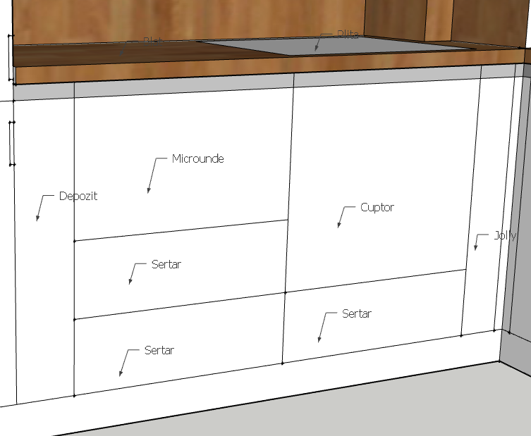
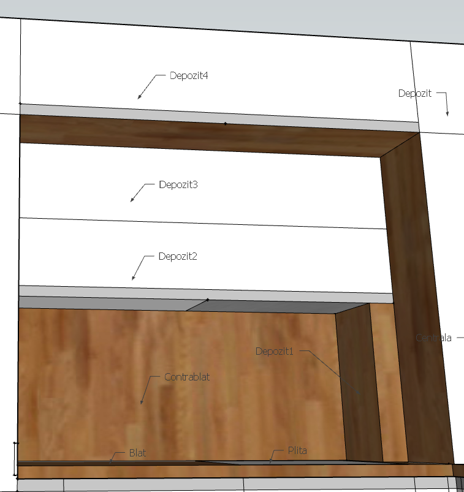
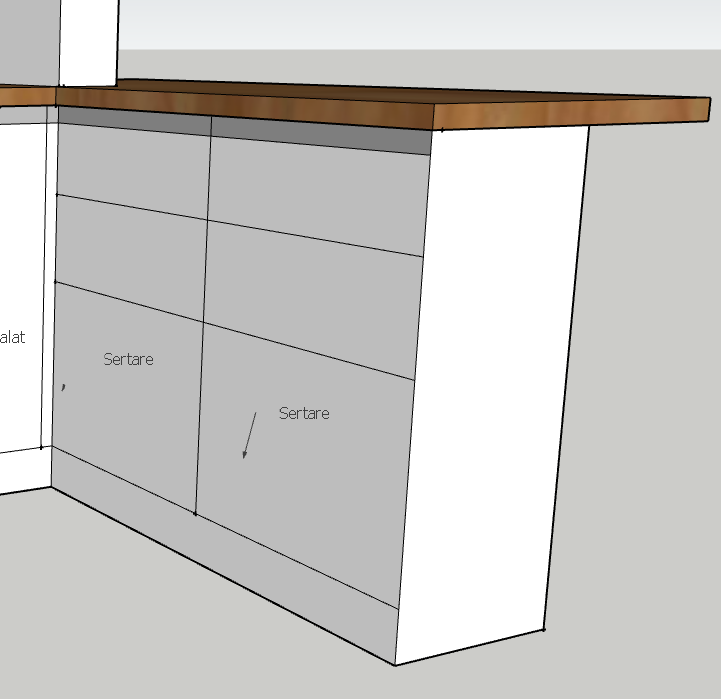

## Generalitati

Materiale suprafete:
- MDF alb cristal HG13
- PAL stejar salbatic natur H1318
- BLAT stejar salbatic natur H1318
- CONTRABLAT stejar salbatic natur H1318

Note semnificative:
- Inaltime corpuri cu blat: 93cm - pentru a putea acomoda masina spalat vase, si ajunge la nivel cu pervaz geam
- Depozitele se deschid cu usa
- Golele pentru compartimentele de sub blat sunt doar imediat sub blat, celelalte compartimente se deschid cu push

## Corp "frigider"

Compartimente, jos-sus:
- Plinta
- Congelator: MDF HG13 la fata, deschidere cu maner
- [Frigider](https://www.grundig.com/content/dam/rainbow-grundig-romania-ro-aem/rainbow-grundig-romania-ro-aemProductCatalog/product-documents/7278749504-GKNI6950FHN/en-US-7278749504-202203081302731-Installation-Diagramen-US.pdf): MDF HG13 la fata, PAL H1318 lateral dreapta, deschidere cu maner
- Depozit: MDF HG13 la fata, deschidere cu push

Note semnificative:
- Modelul de pe PAL H1318 lateral dreapta trebuie sa urmareasca modelul blatului
- Toate usile se deschid din dreapta spre stanga
- Latime cat mai mica pt a distribui cat mai mult blatului din dreapta
- Separarea dintre congelator si frigider sa fie la nivelul blatului
- Separarea dintre frigider si depozit sa fie la nivelul ultimului corp suspendat din dreapta
- Depozitul are in partea stanga o masca, "perete" fals, care permite trecerea tevilor

## Corp "electrocasnice1"

Compartimente, jos-sus si stanga-dreapta:
- Plinta
- Depozit: MDF HG13 la fata, 1 raft orizontal la mijloc, deschidere cu gola
- 2 x Sertar: MDF HG13 la fata, deschidere cu push
- [Microunde](https://www.emag.ro/cuptor-cu-microunde-incorporabil-electrolux-25-l-900w-grill-alb-lms4253tmw/pd/D6SSHQBBM/#specification-section): MDF HG13 la fata, deschidere cu gola
- 1 x Sertar: MDF HG13 la fata, deschidere cu push
- [Cuptor](https://www.emag.ro/cuptor-incorporabil-electrolux-electric-72-l-autocuratare-catalitica-grill-sensecook-touch-control-timer-clasa-a-alb-eoe7c31v/pd/D509TQBBM/#specification-section): MDF HG13 la fata, deschidere cu gola
- Jolly: MDF HG13 la fata
- Blat: H1318
- [Plita](https://www.emag.ro/plita-incorporabila-electrolux-inductie-4-zone-de-gatit-bridge-zona-infinte-optifix-control-touch-60-cm-sticla-alba-eiv63440bw/pd/DWX36JBBM/#specification-section)

Note semnificative:
- Jolly de 14cm latime pentru a profita de cat mai multa latime la depozit
- Sertarul de sub microunde, cel de langa plinta, e de aceeasi inaltime cu cel de sub cuptor
- Sertarul imadiat de sub microunde ocupa inaltimea ramasa

## Corp "suspendat"

Compartimente, jos-sus si stanga-dreapta:
- Contrablat: H1318
- Depozit1: PAL H1318, deschidere cu push
- [Hota](https://www.intax.ro/electrocasnice/hote-de-bucatarie-falmec/hote-incorporabile-falmec/hota-incorporabila-falmec-gruppo-incasso-plus-50-inox-motor-800-mch-sistem-de-comunicare-wireless-intre-plita-si-hota-falmec-aspiratie-perimetrala-iluminare-led-dimabila-si-dynamic-fabricatie-italia-garantie-5-ani-incplus50steel.html)
- Depozit2: MDF HG13 la fata si sub, deschidere cu gola
- Depozit3: MDF HG13 la fata, deschidere cu push
- Depozit4: MDF HG13 la fata, PAL H1318 sub, deschidere cu gola

Note semnificative:
- Modelul de "nervuri" al blatului si contrablatului de la stanga la dreapta, iar restul sa fie in sincron cu blatul
- Depozit2 sa aiba sant pt led
- Depozit2, 3 si 4 cu perete vertical in interior pe mijloc

## Corp "centrala"

Compartimente, jos-sus:
- Centrala: MDF HG13 la fata, PAL H1318 lat stanga, deschidere cu gola
- Depozit: MDF HG13 la fata, deschidere cu push

Note semnificative:
- Modelul de pe PAL H1318 lateral dreapta trebuie sa urmareasca modelul blatului
- Toate usile se deschid din stanga spre dreapta
- Latime cat mai mica pt a distribui cat mai mult blatului din stanga
- Separarea dintre centrala si depozit sa fie la nivelul ultimului corp suspendat din stanga

## Corp "electrocasnice2"

Compartimente, jos-sus si stanga-dreapta:
- Plinta
- Depozit: MDF HG13 la fata, deschidere cu gola
- Masina spalat vase: MDF HG13 la fata, deschidere cu gola
- Blat: H1318
- Contrablat: H1318

Note semnificative:
- Depozitul de sub chiuveta se intinde de-a lungul celor 2 usi + sub centrala
- Chiuveta sa fie centrata in rap cu geamul
- Contrablatul se ridica pana la nivelul cupului centrala, nervurile de la stanga la dreapta, si se imbina cu un sant de ~ 1mm
- Pervazul de piatra se acopera cu o foaie de contrablat

## Corp "insula"

Compartimente, jos-sus si stanga-dreapta:
- Plinta
- 1 x Sertar h40 + MDF HG13 la fata, deschidere cu gola
- 2 x Sertar h20 + MDF HG13 la fata, deschidere cu gola
- 1 x Sertar h40 + MDF HG13 la fata, deschidere cu gola
- 2 x Sertar h20 + MDF HG13 la fata, deschidere cu gola
- Blat: H1318

Note semnificative:
- Blatul are o lungime de 170cm, 110cm dupa perete, dand voie la 55cm latime pt fiecare set de sertare
- Blatul sa fie suspendat 25cm pe latime inspre sufrageriei, ca spatiu pt picioare
- Corpul are un depozit aditional care se acceseaza dispre usa terasei